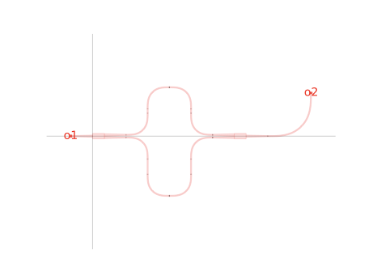
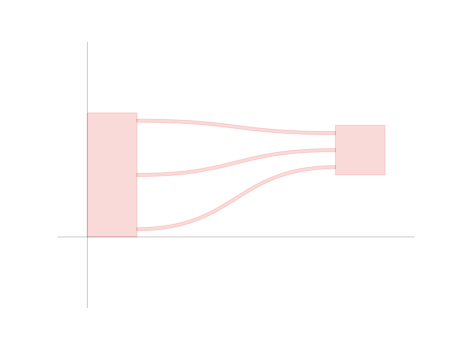
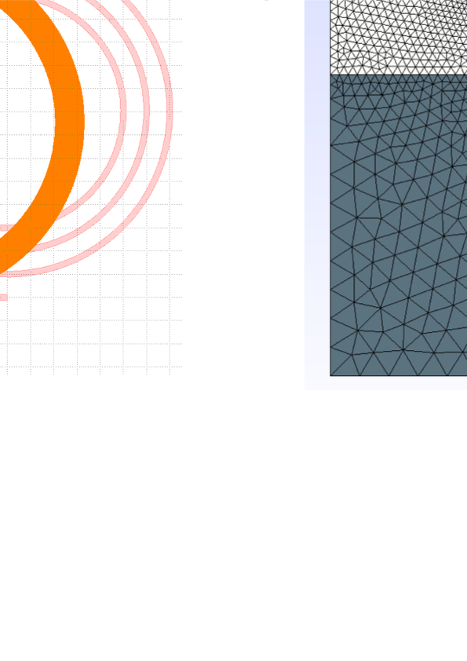

# GDSFactory: An Open-Source Python Library for Chip Design and Simulation

**Authors:** Joaquin Matres<sup>1,*</sup>, Simon Bilodeau<sup>2,3</sup>, Niko Savola<sup>2,4</sup>, Helge Gehring<sup>6</sup> and Troy Tamas<sup>1</sup>

**Affiliations:**
1. GDSFactory, 650 Castro St Ste 120 PMB 98035, Mountain View, CA 94041, USA
2. X Development LLC, 100 Mayfield Ave, Mountain View, CA 94043, USA
3. Department of Electrical and Computer Engineering, Princeton University, Princeton, NJ 08544, USA
4. Department of Applied Physics, Aalto University, PO Box 13500, FIN-00076 Aalto, Finland
6. Google LLC, 1600 Amphitheatre Parkway, Mountain View, CA 94043, USA

**Corresponding author:** *jmatres@GDSFactory.com

## Abstract

We present GDSFactory, an open-source Python library for integrated circuit design automation supporting photonics, analog, quantum, and MEMS applications. The platform provides unified workflows spanning layout design, device simulation through FDTD (MEEP, Tidy3D, Lumerical), FEM (Femwell), and TCAD (DEVSIM) solvers, and circuit simulation via SAX S-parameter analysis.

## 1. Introduction

Hardware iterations typically require months and millions of dollars, while software iterations cost hundreds of dollars and take hours. GDSFactory bridges this gap by providing a comprehensive Python API for chip development, including layout design, device simulation, circuit simulation, and verification [1].

Unlike constrained logic-driven electronic design flows [2], integrated photonics requires freeform parametric geometries and tight integration between layout and electromagnetic simulation. GDSFactory addresses this with scriptable parametric cells (PCells), hierarchical assembly, routing, and seamless interfaces to industry-standard simulators---all in Python's extensive scientific ecosystem.

## 2. Layout Design

GDSFactory implements cells as Python functions returning a `Component` class with polygons, port metadata, and convenience methods. Using KLayout's C++ geometry engine [3], users define PCells with a functional programming approach:

```python
import GDSFactory as gf

@gf.cell
def mzi_with_bend(radius=10):
    c = gf.Component()
    mzi = c.add_ref(gf.components.mzi())
    bend = c.add_ref(
        gf.components.bend_euler(radius=radius))
    bend.connect('o1', mzi['o2'])
    return c
```

The `@gf.cell` decorator handles caching, eliminating redundant regeneration. Port metadata enables automatic routing via `get_route` and `get_bundle` functions that connect components following `CrossSection` specifications (Fig. 1).




**Figure 1:** (a) MZI with Euler bend showing port connections. (b) Routed n×n components using S-bends.

## 3. Device Simulation

GDSFactory's gplugins repository provides unified interfaces to device simulators by reusing layout abstractions. Components can be meshed via GMSH for cross-sectional or 3D analysis (Fig. 2).



**Figure 2:** GDSFactory meshing: (a) heater layout, (b) cross-sectional mesh, (c) 3D mesh.

### 3.1 FDTD Simulation

Full-wave electromagnetic simulation is supported through three FDTD backends:

- **MEEP** [4]: Open-source FDTD solver for computing transmission spectra, field profiles, and S-parameters. GDSFactory automatically generates simulation regions, sources, and monitors from component geometry.
- **Tidy3D** [5]: Cloud-based FDTD with GPU acceleration enabling rapid parametric sweeps. The interface handles geometry export, material mapping, and result retrieval.
- **Lumerical FDTD**: Industry-standard solver integration for users with existing licenses, supporting automated scripting and result import.

### 3.2 Mode and FEM Solvers

- **Femwell** [6]: Open-source FEM solver for waveguide mode analysis, thermal simulation, and electro-optic modeling. Computes effective indices, group indices, and mode overlaps directly from GDSFactory cross-sections.
- **MPB**: MIT Photonic Bands for photonic crystal and periodic structure analysis.
- **MEOW**: Eigenmode expansion (EME) for propagation through adiabatic tapers and mode converters.

### 3.3 TCAD Simulation

- **DEVSIM** [7]: Open-source TCAD for semiconductor device physics, enabling carrier transport and electro-optic modulator simulation. GDSFactory exports doped regions and contacts directly to DEVSIM meshes.
- **Sentaurus**: Commercial TCAD integration for advanced process and device simulation.

## 4. Circuit Simulation

Circuit-level simulation enables system-scale photonic design through netlist extraction and S-parameter composition.

### 4.1 SAX S-Parameter Analysis

SAX [8] provides differentiable S-parameter circuit simulation using JAX. GDSFactory extracts hierarchical netlists from layouts, associating each component with its S-parameter model:

```python
import sax

# Define component models
models = {
    "mmi1x2": sax.models.mmi1x2,
    "bend_euler": sax.models.bend_euler,
    "straight": sax.models.straight,
}

# Simulate circuit from netlist
circuit, _ = sax.circuit(netlist=netlist, models=models)
S = circuit(wl=1.55)
```

SAX supports:
- Automatic differentiation for gradient-based optimization
- Montecarlo analysis for yield estimation
- Wavelength-dependent S-parameter interpolation from FDTD results

### 4.2 SPICE Integration

VLSIR provides SPICE netlist export for mixed photonic-electronic simulation, enabling co-simulation with control electronics.

## 5. Process Design Kits

Open-source PDKs include GlobalFoundries 180nm, SkyWater 130nm [9], VTT 3 μm SOI, and SiEPIC. Commercial PDKs under NDA include AIM, AMF, TowerSemi, IMEC, and HHI. The generic PDK follows standard layer conventions [10] for cross-foundry compatibility. Each PDK includes layer definitions, design rules, and validated component models for circuit simulation.

## 6. Conclusion

GDSFactory provides a unified Python-driven workflow spanning layout design, device simulation, and circuit simulation. The tight integration between FDTD solvers (MEEP, Tidy3D, Lumerical), FEM tools (Femwell, DEVSIM), and circuit simulators (SAX) enables rapid design iteration from component to system level. The library is freely available at https://github.com/GDSFactory/GDSFactory.

## References

1. J. Matres *et al.*, "GDSFactory," GitHub (2024), https://github.com/GDSFactory/GDSFactory.

2. W. Bogaerts *et al.*, "Silicon photonics circuit design: methods, tools and challenges," Laser Photon. Rev. **12**, 1700237 (2018).

3. M. Köfferlein, "KLayout," https://www.klayout.de/.

4. A. F. Oskooi *et al.*, "MEEP: A flexible free-software package for electromagnetic simulations by the FDTD method," Comput. Phys. Commun. **181**, 687--702 (2010).

5. Flexcompute Inc., "Tidy3D," https://www.flexcompute.com/tidy3d/.

6. H. Gehring *et al.*, "Femwell," GitHub (2023), https://github.com/HelgeGehring/femwell.

7. J. E. Sanchez, "DEVSIM," https://devsim.org/.

8. F. Laporte, "SAX," GitHub (2023), https://github.com/flaport/sax.

9. SkyWater Technology Foundry and Google, "SkyWater Open Source PDK," GitHub (2023), https://github.com/google/skywater-pdk.

10. L. Chrostowski and M. Hochberg, *Silicon Photonics Design* (Cambridge, 2015).
